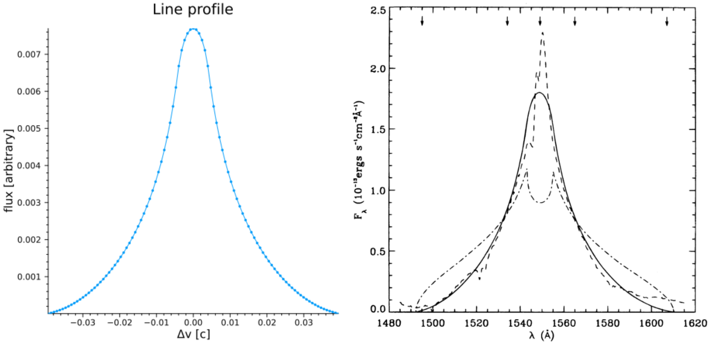
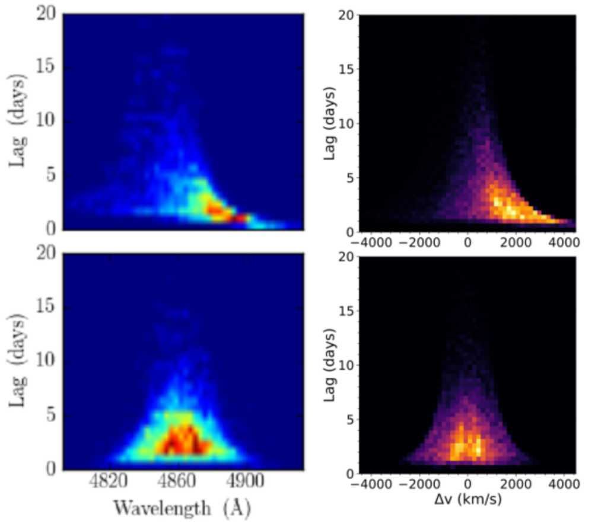
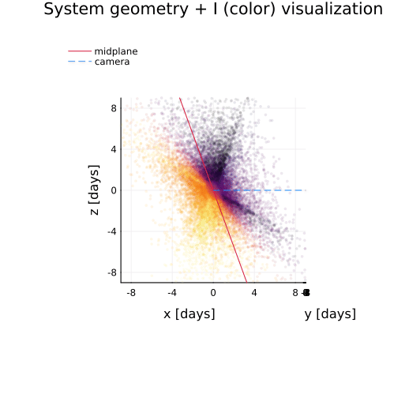
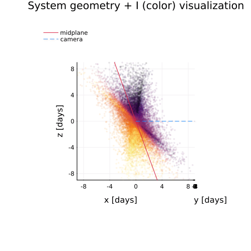

# Usage and Examples

This guide explores a few more complicated tasks one might wish to use this code for. 

```@contents
Pages = ["usage_examples.md"]
Depth = 2:3
```

## Reproducing the line profile and transfer function shown in [CM96](https://ui.adsabs.harvard.edu/abs/1996ApJ...466..704C/abstract)

CM96 showed that disk-wind models of the BLR could produce single-peaked line profiles, and as part of their results they generated a hypothetical 2D transfer function for a disk-wind BLR as applied to NGC 5548. We can reproduce such a map with just a few lines of code using `BLR.jl`.

First, let's define the model using [`DiskWindModel`](@ref BLR.DiskWindModel): 
```julia
mCM96 = BLR.DiskWindModel(3000.,100.,1.,75/180*π,
        nr=5096,nϕ=1024,scale=:log,f1=1.0,f2=1.0,f3=0.0,f4=0.0,
        I=BLR.DiskWindIntensity,v=BLR.vCircularDisk,τ=5.0,reflect=false)
```

We use the parameters from CM96 for ``\bar{r} = 3000\rm{r_s}``, ``r_{\rm{fac}} = 10^2``, ``\alpha = 1``, and ``i = 75^{\circ}``. CM96 considered the case of radial and Keplerian shear only, so we turn these gradients on by setting ``f_1 = 1`` and ``f_2 = 1`` (radial and Keplerian shear, respectively) and turn off the remaining velocity gradients by setting ``f_3 = 0`` and ``f_4 = 0``. 

To have a well sampled model grid we pick `nr=5096` and `nϕ=1024` with `scale=:log`, which will result in the returned model object having 5096 "rings" in our circular camera aperture with each ring holding 1024 grid cells evenly divided in ``\\phi`` space. 

While this is the default, for the sake of this demonstration we also set [`I=BLR.DiskWindIntensity`](@ref BLR.DiskWindIntensity) to explicitly tell the model to use the intensity formulation first proposed in CM96 (and using the "f" parameter language introduced in Long+2023). We also tell the model to calculate the velocities according to the built in function [`BLR.vCircularDisk`](@ref BLR.vCircularDisk), which simply calculates the projected line of sight velocity as ``v = \sqrt{\frac{\rm{r_s}}{2r}}\sin i \sin\phi``. 

Finally, while not required, we set `τ = 5.0` as we want our disk to be optically thick and `reflect = false` as we do not want to move any points from the back to the front. 

### Generating the line profile
Now that we have a model, let's get the line profile and store it in our model:

```julia
p = BLR.getProfile(mCM96,:line,bins=101) #get the line profile using 101 bins in velocity-space, otherwise using default params
BLR.setProfile!(mCM96,p) #store the line profile in our model structure
```

We can do a quick visualization with the built-in [`profile`](@ref BLR.profile!) macro:

```julia
BLR.profile(mCM96) #plot all profiles stored in model object, here we only have set :line so only :line will be plotted
```
Which should return a plot like this (left panel, right panel is Figure 2 in CM96):



Note that the y-axis units are arbitrary and the x-axis is in units of velocity [``c``], not ``\lambda`` as published in Fig 2 of [CM96](https://articles.adsabs.harvard.edu/pdf/1996ApJ...466..704C), but the shape clearly matches their result that the line profile for such a model should be single-peaked. This is also showing only the full model line profile (thei solid line), not the data or other models. We could reproduce their plot exactly by rescaling our flux and converting from velocity-space to wavelength space as well as plotting the data and a model line profile with azimuthally isotropic emission, but we will leave that as an exercise for the motivated reader...

### Generating the transfer function 

It is similarly easy to use `BLR.jl` to generate transfer functions for any user-defined model. In looking at Figure 4 of [CM96](https://articles.adsabs.harvard.edu/pdf/1996ApJ...466..704C) we see that their y-axis (delays) spans 0-20 days and the x-axis (projected velocity) -12-12 (``10^8`` ``\rm{cm}`` ``\rm{s}^-1``). To match our model result to theirs, we first need to convert our units of ``\rm{r_s}`` to the more physical unit of days. CM96 used ``M_{\rm{NGC5548}} \approx 10^8 \rm{M_{\odot}}``, which means we can calculate the conversion factor as:

```julia
M = 1e8*2e30 #kg
rs = 2*M*6.67e-11/9e16 #2GM/c^2
rsDay = rs/3e8/3600/24 #days
```

We only need to obtain the transfer function ``\Psi`` over the range shown in CM96, so let's define the `tEdges` and `vEdges` we want to use to match their result and then generate the transfer function:

```julia
tEdges = collect(range(0.0,stop=20.0/rsDay,length=101)) #will generate 100 bins, convert 20 days upper limit to units of rs
vEdges = collect(range(-0.04,stop=0.04,length=101)) #0.04c ~12*1e8 cm/s
Ψ = BLR.getΨ(mCM96,vEdges,tEdges) #obtain transfer function with our supplied bin edges 
```

Note that in Fig. 4 of [CM96](https://articles.adsabs.harvard.edu/pdf/1996ApJ...466..704C) the edges between the colors are sharp, indicating that they used discrete bins in their image to better showcase structure. While these levels are not explicitly supplied in the paper, we can make a good guess that they are somewhat evenly spaced logarithmic bins. To transform our ``\Psi`` to match their binning, we can do something like: 

```julia
function getΨMatch(ΨBinned,levels=[-0.4*i for i=0:11]) #generate constant log10 bins of Ψ
    #fills intervals that are closed at the top;
    #that is, for regions z1 and z2 the filled region is z1 < Z <= z2"

    logΨ = log10.(ΨBinned)
    res = zeros(size(logΨ))
    mask = (logΨ .<= levels[2]) .& (logΨ .>= levels[1])
    res[mask] .= (levels[1]+levels[2])/2
    for i=2:length(levels)-1
        mask = (logΨ .< levels[i]) .& (logΨ .>= levels[i+1])
        res[mask] .= (levels[i]+levels[i+1])/2
    end
    mask = (logΨ .< levels[end])
    res[mask] = logΨ[mask]
    return res
end
ΨDiscrete = getΨMatch(Ψ./maximum(Ψ)) #normalize and generate discrete bins
```

All that's left to do now is visualize the result, which we will do with the `heatmap` function from Julia's `Plots.jl`:

```julia
heatmap(reverse(vEdges).*3e10/1e8,tEdges.*rsDay,ΨDiscrete',
    ylims=(0,20),xlims=(-12,12),clims=(-4.4,0.0),cbar=false,
    xlabel="v (10⁸ cm/s)",ylabel="τ (days)",minorticks=true,
    tickdirection=:out,widen=false,size=(500,500))
```

Which should return something like this (left plot, right plot is Fig 4. in CM96):


While our binning is a little off/coarser than in CM96, this is clearly a pretty good match for a quick and dirty calculation. 

A few final notes: 
1. Note that when plotting we use `ΨDiscrete'` because heatmap expects the shape of the image variable to be flipped from how `BLR.jl` calculates it (the shape of `Ψ` when returned is (number of velocity bins, number of t bins)). 
2. If you wanted to generate just the 1D response function as shown in CM96 Figure 5, `BLR.jl` has syntax for that too: `tCenters, Ψt = BLR.getΨt(mCM96,101,10/rsDay)`. 

## Reproducing sample cloud model results from [Pancoast+2014](https://ui.adsabs.harvard.edu/abs/2014MNRAS.445.3055P/abstract)

We can also generate "cloud"/thick-disk models of the BLR similar to [Pancoast+2014](https://ui.adsabs.harvard.edu/abs/2014MNRAS.445.3055P/abstract) easily with `BLR.jl`. In this section we will reproduce part of Figure 4 in [Pancoast+2014](https://ui.adsabs.harvard.edu/abs/2014MNRAS.445.3055P/abstract), which shows five different model BLRs and their 1D transfer functions with the following parameters: 

| parameter               | model 1     | model 2     |     
|:-----------------------:|:-----------:|:-----------:|
|``r_{\rm{mean}}`` [days] |4.0          |4.0          |
|``F``                    |0.25         |0.25         |
|``\beta``                |1.0          |0.8          |
|``\theta_o`` [deg]       |40           |30           |
|``i`` [deg]              |20           |20           |
|``\kappa``               |-0.4         |-0.4         |
|``\gamma``               |5.0          |5.0          |
|``\xi``                  |0.3          |0.1          |
|``f_{\rm{ellipse}}``     |0.0          |1.0          |
|``f_{\rm{flow}}``        |0.0          |-            |
|``\theta_e`` [deg]       |0.0          |-            |
|``\sigma_{\rm{turb}}``   |0.0          |0.0          |

First, we initialize model structs for both of these cases:
```julia
M = 10^(6.5)*2e30 #kg, from Pancoast+2014
rs = 2*6.67e-11*M/9e16 #2GM/c^2, m
rsDay = rs/3e8/3600/24 #days^C #days -- model expects μ in units of rₛ
nClouds = 100_000 #small number of clouds just for demonstration
mP1 = BLR.cloudModel(nClouds,μ=4/rsDay,F=0.25,β=1.0,θₒ=40/180*π,i=20/180*π,
        κ=-0.4,γ=5.0,ξ=0.3,fEllipse=0.0,fFlow=0.0,θₑ=0.0,σₜ=0.0,
        σρc=0.0,σΘᵣ=0.0,σΘc=0.0,σρᵣ=0.0,
        I=BLR.cloudIntensity,v=BLR.vCloudTurbulentEllipticalFlow,τ=0.0)
mP2 = BLR.cloudModel(nClouds,μ=4/rsDay,F=0.25,β=0.8,θₒ=30/180*π,i=20/180*π,
        κ=-0.4,γ=5.0,ξ=0.1,fEllipse=1.0,σₜ=0.0,
        fFlow=0.0,θₑ=0.0,σρc=0.0,σΘᵣ=0.0,σΘc=0.0,σρᵣ=0.0,
        I=BLR.cloudIntensity,v=BLR.vCloudTurbulentEllipticalFlow,τ=0.0)
```
Where the first argument passed to [`cloudModel`](@ref BLR.cloudModel) is the number of clouds to generate (here we use a relatively small number just for demonstration purposes), and the keyword arguments supplied mostly correspond to the values in the table above and are fully described in [Pancoast+2014](https://ui.adsabs.harvard.edu/abs/2014MNRAS.445.3055P/abstract). The extra keyword arguments set to 0 but not in the table are options not used in this calculation, and the final line specifies that we would like the intensity calculated with the [`cloudIntensity`](@ref BLR.cloudIntensity) function, the velocities calculated with [`vCloudTurbulentEllipticalFlow`](@ref BLR.vCloudTurbulentEllipticalFlow), and that the optical depth of the cloud is 0.

To compare to Figure 4 in [Pancoast+2014](https://ui.adsabs.harvard.edu/abs/2014MNRAS.445.3055P/abstract) we can again generate transfer functions for both models:

```julia
vEdges = collect(range(-0.015,stop=0.015,length=51)) #Δλ/λ ~ v/c
tEdges = collect(range(0.0,stop=20.0/rsDay,length=51))
Ψ1 = BLR.getΨ(mP1,vEdges,tEdges)
Ψ2 = BLR.getΨ(mP2,vEdges,tEdges)
p1 = heatmap(vEdges.*3e5,tEdges.*rsDay,(Ψ1'./maximum(Ψ1)),ylims=(0,20),cbar=false,
    xlabel="Δv (km/s)",ylabel="Lag (days)",minorticks=true,tickdirection=:out,
    widen=false,size=(500,500),guidefontsize=18,tickfontsize=16)
p2 = heatmap(vEdges.*3e5,tEdges.*rsDay,(Ψ2'./maximum(Ψ2)),ylims=(0,20),cbar=false,
    xlabel="Δv (km/s)",ylabel="Lag (days)",minorticks=true,tickdirection=:out,
    widen=false,size=(500,500),guidefontsize=18,tickfontsize=16)
```

Which should produce something like the right column of plots in the comparison below (top plot = `p1` and bottom = `p2`):



Note that again we are just trying to roughly match the color scale by eye, but the general shape and morphology looks good.

We can also quickly visualize the geometry of the system from any angle (i.e. to compare to the rightmost panel of Fig. 4 in [Pancoast+2014](https://ui.adsabs.harvard.edu/abs/2014MNRAS.445.3055P/abstract)) using the built-in [`plot3d`](@ref BLR.plot3d) macro:

```julia
BLR.plot3d(mP1,:I,cam=(10,10)) #visualize the system with points colored by their intensity with a camera at 10 deg azimuth and altitude
```

Iterating this over a wide variety of camera angles one can produce fun 3D visualizations of the BLR models like the gifs below:

| model 1                           | model 2                           |
|:---------------------------------:|:---------------------------------:|
|||

Comparing to the stills in Figure 4 of [Pancoast+2014](https://ui.adsabs.harvard.edu/abs/2014MNRAS.445.3055P/abstract) again shows good agreement (note that in generating this animation the number of clouds was set to be just 2,000 to better show the structure/agreement with Pancoast+2014). 

## Reproducing the line and phase profiles shown in Long+2023 

## Reproducing the combined model line and delay profiles shown in Long+2025 