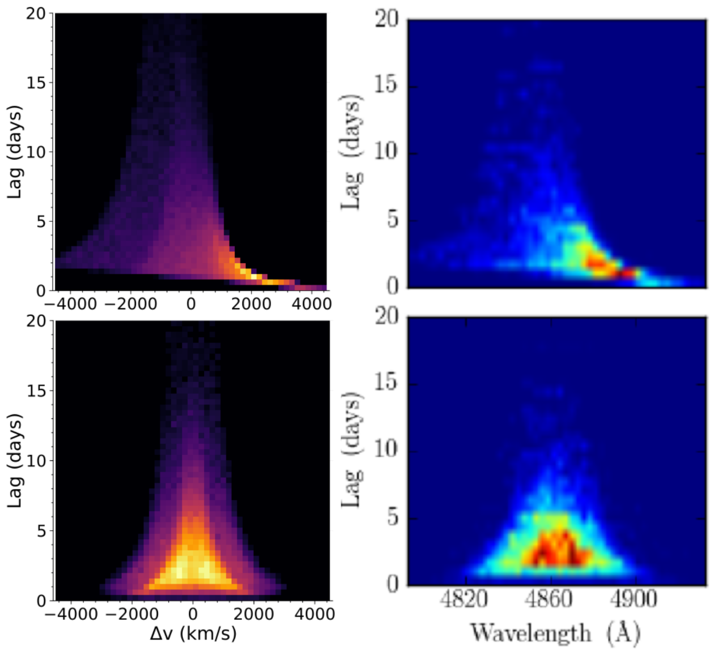
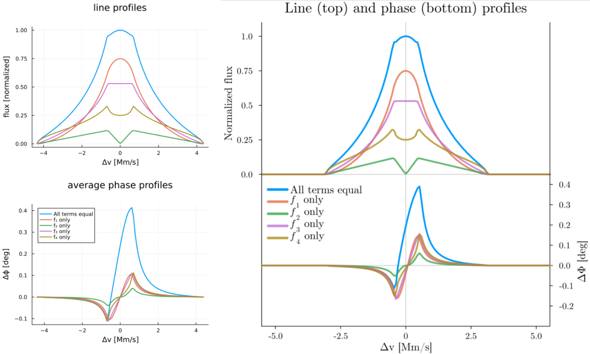

# Usage and Examples

This guide explores a few more complicated tasks one might wish to use this code for. 

```@contents
Pages = ["usage_examples.md"]
Depth = 2:3
```

## Reproducing the line profile and transfer function shown in [CM96](https://ui.adsabs.harvard.edu/abs/1996ApJ...466..704C/abstract)

CM96 showed that disk-wind models of the BLR could produce single-peaked line profiles, and as part of their results they generated a hypothetical 2D transfer function for a disk-wind BLR as applied to NGC 5548. We can reproduce such a map with just a few lines of code using `BroadLineRegions.jl`. 

!!! note
    `BroadLineRegions.jl` exports itself as both `BroadLineRegions` *and* the shorter `BLR`. We will use the shorter `BLR` throughout these examples but know that `BLR` is equivalent to `BroadLineRegions` should you prefer the longer version.

First, let's define the model using [`DiskWindModel`](@ref BLR.DiskWindModel): 
```julia
using BroadLineRegions
mCM96 = BLR.DiskWindModel(3000.,100.,1.,75/180*π,
        nr=2048,nϕ=1024,scale=:log,f1=1.0,f2=1.0,f3=0.0,f4=0.0,
        I=BLR.DiskWindIntensity,v=BLR.vCircularDisk,τ=5.0,reflect=false)
```

We use the parameters from CM96 for ``\bar{r} = 3000\rm{r_s}``, ``r_{\rm{fac}} = 10^2``, ``\alpha = 1``, and ``i = 75^{\circ}``. CM96 considered the case of radial and Keplerian shear only, so we turn these gradients on by setting ``f_1 = 1`` and ``f_2 = 1`` (radial and Keplerian shear, respectively) and turn off the remaining velocity gradients by setting ``f_3 = 0`` and ``f_4 = 0``. 

To have a well sampled model grid we pick `nr=5096` and `nϕ=1024` with `scale=:log`, which will result in the returned model object having 5096 "rings" in our circular camera aperture with each ring holding 1024 grid cells evenly divided in ``\\phi`` space. 

While this is the default, for the sake of this demonstration we also set [`I=BLR.DiskWindIntensity`](@ref BLR.DiskWindIntensity) to explicitly tell the model to use the intensity formulation first proposed in CM96 (and using the "f" parameter language introduced in Long+2023). We also tell the model to calculate the velocities according to the built in function [`BLR.vCircularDisk`](@ref BLR.vCircularDisk), which simply calculates the projected line of sight velocity as ``v = \sqrt{\frac{\rm{r_s}}{2r}}\sin i \sin\phi``. 

Finally, while not required, we set `τ = 5.0` as we want our disk to be optically thick and `reflect = false` as we do not want to move any points from the back to the front. 

Now that we have a model, let's get the line profile and store it in our model:

```julia
p = BLR.getProfile(mCM96,:line,bins=101) #get the line profile using 101 bins in velocity-space, otherwise using default params
BLR.setProfile!(mCM96,p) #store the line profile in our model structure
```

We can do a quick visualization with the built-in [`profile`](@ref BLR.profile!) macro:

```julia
BLR.profile(mCM96) #plot all profiles stored in model object, here we only have set :line so only :line will be plotted
```
Which should return a plot like this (left panel, right panel is Figure 2 in CM96):


Note that the y-axis units are arbitrary and the x-axis is in units of velocity [``c``], not ``\lambda`` as published in Fig 2 of [CM96](https://articles.adsabs.harvard.edu/pdf/1996ApJ...466..704C), but the shape clearly matches their result that the line profile for such a model should be single-peaked. This is also showing only the full model line profile (thei solid line), not the data or other models. We could reproduce their plot exactly by rescaling our flux and converting from velocity-space to wavelength space as well as plotting the data and a model line profile with azimuthally isotropic emission, but we will leave that as an exercise for the motivated reader...

It is similarly easy to use `BroadLineRegions.jl` to generate transfer functions for any user-defined model. In looking at Figure 4 of [CM96](https://articles.adsabs.harvard.edu/pdf/1996ApJ...466..704C) we see that their y-axis (delays) spans 0-20 days and the x-axis (projected velocity) -12-12 (``10^8`` ``\rm{cm}`` ``\rm{s}^-1``). To match our model result to theirs, we first need to convert our units of ``\rm{r_s}`` to the more physical unit of days. CM96 used ``M_{\rm{NGC5548}} \approx 10^8 \rm{M_{\odot}}``, which means we can calculate the conversion factor as:

```julia
M = 1e8*2e30 #kg
rs = 2*M*6.67e-11/9e16 #2GM/c^2
rsDay = rs/3e8/3600/24 #days
```

We only need to obtain the transfer function ``\Psi`` over the range shown in CM96, so let's define the `tEdges` and `vEdges` we want to use to match their result and then generate the transfer function:

```julia
tEdges = collect(range(0.0,stop=20.0/rsDay,length=101)) #will generate 100 bins, convert 20 days upper limit to units of rs
vEdges = collect(range(-0.04,stop=0.04,length=101)) #0.04c ~12*1e8 cm/s
Ψ = BLR.getΨ(mCM96,vEdges,tEdges) #obtain transfer function with our supplied bin edges 
```

Note that in Fig. 4 of [CM96](https://articles.adsabs.harvard.edu/pdf/1996ApJ...466..704C) the edges between the colors are sharp, indicating that they used discrete bins in their image to better showcase structure. While these levels are not explicitly supplied in the paper, we can make a good guess that they are somewhat evenly spaced logarithmic bins. To transform our ``\Psi`` to match their binning, we can do something like: 

```julia
function getΨMatch(ΨBinned,levels=[-0.4*i for i=0:11]) #generate constant log10 bins of Ψ
    #fills intervals that are closed at the top;
    #that is, for regions z1 and z2 the filled region is z1 < Z <= z2"

    logΨ = log10.(ΨBinned)
    res = zeros(size(logΨ))
    mask = (logΨ .<= levels[2]) .& (logΨ .>= levels[1])
    res[mask] .= (levels[1]+levels[2])/2
    for i=2:length(levels)-1
        mask = (logΨ .< levels[i]) .& (logΨ .>= levels[i+1])
        res[mask] .= (levels[i]+levels[i+1])/2
    end
    mask = (logΨ .< levels[end])
    res[mask] = logΨ[mask]
    return res
end
ΨDiscrete = getΨMatch(Ψ./maximum(Ψ)) #normalize and generate discrete bins
```

All that's left to do now is visualize the result, which we will do with the `heatmap` function from Julia's `Plots.jl`:

```julia
using Plots

heatmap(vEdges.*3e10/1e8,tEdges.*rsDay,ΨDiscrete',
    ylims=(0,20),xlims=(-12,12),clims=(-4.4,0.0),cbar=false,
    xlabel="v (10⁸ cm/s)",ylabel="τ (days)",minorticks=true,
    tickdirection=:out,widen=false,size=(500,500))
```

Which should return something like this (left plot, right plot is Fig 4. in CM96):


While our binning is a little off/coarser than in CM96, this is clearly a pretty good match for a quick and dirty calculation. 

A few final notes: 
1. Note that when plotting we use `ΨDiscrete'` because heatmap expects the shape of the image variable to be flipped from how `BroadLineRegions.jl` calculates it (the shape of `Ψ` when returned is (number of velocity bins, number of t bins)). 
2. If you wanted to generate just the 1D response function as shown in CM96 Figure 5, `BroadLineRegions.jl` has syntax for that too: `tCenters, Ψt = BLR.getΨt(mCM96,101,10/rsDay)`. 

## Reproducing sample cloud model results from [Pancoast+2014](https://ui.adsabs.harvard.edu/abs/2014MNRAS.445.3055P/abstract)

We can also generate "cloud"/thick-disk models of the BLR similar to [Pancoast+2014](https://ui.adsabs.harvard.edu/abs/2014MNRAS.445.3055P/abstract) easily with `BroadLineRegions.jl`. In this section we will reproduce part of Figure 4 in [Pancoast+2014](https://ui.adsabs.harvard.edu/abs/2014MNRAS.445.3055P/abstract), which shows five different model BLRs and their 1D transfer functions with the following parameters: 

| parameter               | model 1     | model 2     |     
|:-----------------------:|:-----------:|:-----------:|
|``r_{\rm{mean}}`` [days] |4.0          |4.0          |
|``F``                    |0.25         |0.25         |
|``\beta``                |1.0          |0.8          |
|``\theta_o`` [deg]       |40           |30           |
|``i`` [deg]              |20           |20           |
|``\kappa``               |-0.4         |-0.4         |
|``\gamma``               |5.0          |5.0          |
|``\xi``                  |0.3          |0.1          |
|``f_{\rm{ellipse}}``     |0.0          |1.0          |
|``f_{\rm{flow}}``        |0.0          |-            |
|``\theta_e`` [deg]       |0.0          |-            |
|``\sigma_{\rm{turb}}``   |0.0          |0.0          |

First, we initialize model structs for both of these cases:
```julia
M = 10^(6.5)*2e30 #kg, from Pancoast+2014
rs = 2*6.67e-11*M/9e16 #2GM/c^2, m
rsDay = rs/3e8/3600/24 #days^C #days -- model expects μ in units of rₛ
nClouds = 100_000 #small number of clouds just for demonstration
mP1 = BLR.cloudModel(nClouds,μ=4/rsDay,F=0.25,β=1.0,θₒ=40/180*π,i=20/180*π,
        κ=-0.4,γ=5.0,ξ=0.3,fEllipse=0.0,fFlow=0.0,θₑ=0.0,σₜ=0.0,
        σρc=0.0,σΘᵣ=0.0,σΘc=0.0,σρᵣ=0.0,
        I=BLR.cloudIntensity,v=BLR.vCloudTurbulentEllipticalFlow,τ=0.0)
mP2 = BLR.cloudModel(nClouds,μ=4/rsDay,F=0.25,β=0.8,θₒ=30/180*π,i=20/180*π,
        κ=-0.4,γ=5.0,ξ=0.1,fEllipse=1.0,σₜ=0.0,
        fFlow=0.0,θₑ=0.0,σρc=0.0,σΘᵣ=0.0,σΘc=0.0,σρᵣ=0.0,
        I=BLR.cloudIntensity,v=BLR.vCloudTurbulentEllipticalFlow,τ=0.0)
```
Where the first argument passed to [`cloudModel`](@ref BLR.cloudModel) is the number of clouds to generate (here we use a relatively small number just for demonstration purposes), and the keyword arguments supplied mostly correspond to the values in the table above and are fully described in [Pancoast+2014](https://ui.adsabs.harvard.edu/abs/2014MNRAS.445.3055P/abstract). The extra keyword arguments set to 0 but not in the table are options not used in this calculation, and the final line specifies that we would like the intensity calculated with the [`cloudIntensity`](@ref BLR.cloudIntensity) function, the velocities calculated with [`vCloudTurbulentEllipticalFlow`](@ref BLR.vCloudTurbulentEllipticalFlow), and that the optical depth of the cloud is 0.

To compare to Figure 4 in [Pancoast+2014](https://ui.adsabs.harvard.edu/abs/2014MNRAS.445.3055P/abstract) we can again generate transfer functions for both models:

```julia
using Plots

vEdges = collect(range(-0.015,stop=0.015,length=51)) #Δλ/λ ~ v/c
tEdges = collect(range(0.0,stop=20.0/rsDay,length=51))
Ψ1 = BLR.getΨ(mP1,vEdges,tEdges)
Ψ2 = BLR.getΨ(mP2,vEdges,tEdges)
p1 = heatmap(vEdges.*3e5,tEdges.*rsDay,(Ψ1'./maximum(Ψ1)).^(1/2),ylims=(0,20),cbar=false,
    xlabel="Δv (km/s)",ylabel="Lag (days)",minorticks=true,tickdirection=:out,
    widen=false,size=(500,500),guidefontsize=18,tickfontsize=16)
p2 = heatmap(vEdges.*3e5,tEdges.*rsDay,(Ψ2'./maximum(Ψ2)).^(1/2),ylims=(0,20),cbar=false,
    xlabel="Δv (km/s)",ylabel="Lag (days)",minorticks=true,tickdirection=:out,
    widen=false,size=(500,500),guidefontsize=18,tickfontsize=16)
```

Which should produce something like the left column of plots in the comparison below (top plot = `p1` and bottom = `p2`):



Note that again we are just trying to roughly match the color scale by eye, but the general shape and morphology looks good.

We can also quickly visualize the geometry of the system from any angle (i.e. to compare to the rightmost panel of Fig. 4 in [Pancoast+2014](https://ui.adsabs.harvard.edu/abs/2014MNRAS.445.3055P/abstract)) using the built-in [`plot3d`](@ref BLR.plot3d) macro:

```julia
BLR.plot3d(mP1,:I,cam=(10,10)) #visualize the system with points colored by their intensity with a camera at 10 deg azimuth and altitude
```

Iterating this over a wide variety of camera angles one can produce fun 3D visualizations of the BLR models like the gifs below:

| model 1                           | model 2                           |
|:---------------------------------:|:---------------------------------:|
|||

Comparing to the stills in Figure 4 of [Pancoast+2014](https://ui.adsabs.harvard.edu/abs/2014MNRAS.445.3055P/abstract) again shows good agreement (note that in generating this animation the number of clouds was set to be just 2,000 to better show the structure/agreement with Pancoast+2014). 

## Reproducing the line and phase profiles shown in [Long+2023](https://dx.doi.org/10.3847/1538-4357/ace4bb) 

While reverberation mapping has historically been the primary way to constrain the properties of the BLR, advances in interferometry have recently allowed for the BLR to be directly "imaged" by [GRAVITY on the VLTI](https://ui.adsabs.harvard.edu/abs/2019Msngr.178...20A/abstract), up to [``z\sim 2.5``](https://www.nature.com/articles/s41586-024-07053-4)! 

Here we will demonstrate how to generate line and *phase* profiles for model BLRs, reproducing the results shown in the left panel in Figure 2 of [Long+2023](https://dx.doi.org/10.3847/1538-4357/ace4bb) in the process. To start, we define disk-wind model objects for each case shown in the figure: 
```julia
mLAll = BLR.DiskWindModel(8e3,45.,1.,45/180*π,nr=2048,nϕ=1024,
        I=BLR.DiskWindIntensity,v=BLR.vCircularDisk,f1=1.0,f2=1.0,
        f3=1.0,f4=1.0,τ=5.,reflect=false)
mLf1 = BLR.DiskWindModel(8e3,45.,1.,45/180*π,nr=2048,nϕ=1024,
        I=BLR.DiskWindIntensity,v=BLR.vCircularDisk,f1=1.0,f2=0.0,
        f3=0.0,f4=0.0,τ=5.,reflect=false)
mLf2 = BLR.DiskWindModel(8e3,45.,1.,45/180*π,nr=2048,nϕ=1024,
        I=BLR.DiskWindIntensity,v=BLR.vCircularDisk,f1=0.0,f2=1.0,
        f3=0.0,f4=0.0,τ=5.,reflect=false)
mLf3 = BLR.DiskWindModel(8e3,45.,1.,45/180*π,nr=2048,nϕ=1024,
        I=BLR.DiskWindIntensity,v=BLR.vCircularDisk,f1=0.0,f2=0.0,
        f3=1.0,f4=0.0,τ=5.,reflect=false)
mLf4 = BLR.DiskWindModel(8e3,45.,1.,45/180*π,nr=2048,nϕ=1024,
        I=BLR.DiskWindIntensity,v=BLR.vCircularDisk,f1=0.0,f2=0.0,
        f3=0.0,f4=1.0,τ=5.,reflect=false)
```
Setting the values in [`DiskWindModel`](@ref BLR.DiskWindModel) to approximately match those in the paper. 

We can then generate the line profiles for each just as we did in the CM96 example above:
```
LPAll = BLR.getProfile(mLAll,:line,bins=101,centered=true)
LPf1 = BLR.getProfile(mLf1,:line,bins=101,centered=true)
LPf2 = BLR.getProfile(mLf2,:line,bins=101,centered=true)
LPf3 = BLR.getProfile(mLf3,:line,bins=101,centered=true)
LPf4 = BLR.getProfile(mLf4,:line,bins=101,centered=true)
```
Note that this time we don't store the profiles in their respective models (although we could!) because we are going to plot all of the models on top of each other by hand. 

To generate the average phase profile we need to pass a few bits of additional information to the [`phase`](@ref BLR.phase) function. As the documenation there shows, we must supply the U-V baseline information (in units of ``\rm{M\lambda}``), the position angle, and the angular scale size of the BLR. Using the published information in the paper we can set these quantities and generate the average phase profiles like so:
```julia
#"off" axis U-V baselines as in Gravity+2019, Long+2023
U = [-14.942664391893409, -29.796334354450384, -14.76368897621181, -7.76620715016356, -11.58052554955926, -4.073062007808528, -14.957054767646966, -28.352905965208993, -13.459074151241555, -13.168981507518257, -23.464313904842403, -10.912122036718138] #Mλ
V = [-15.04195936592504, -36.26778925081391, -21.229760064196043, -14.479367253742678, -35.24862063439095, -20.773150186942956, -14.816925731069297, -35.8588243819711, -21.043799197907198, -15.401140293812933, -37.58326121804998, -21.630778375611328] #Mλ
BLRAng = 2*8e7*2e33*6.67e-8/9e20/548/3.09e24 #rₛ in radians for BLR distance of 548 Mpc
PA = 300/180*π #rad

phaseAll = BLR.getProfile(mLAll,:phase,bins=101,centered=true,U=U,V=V,PA=PA,BLRAng=BLRAng)
phasef1 = BLR.getProfile(mLf1,:phase,bins=101,centered=true,U=U,V=V,PA=PA,BLRAng=BLRAng)
phasef2 = BLR.getProfile(mLf2,:phase,bins=101,centered=true,U=U,V=V,PA=PA,BLRAng=BLRAng)
phasef3 = BLR.getProfile(mLf3,:phase,bins=101,centered=true,U=U,V=V,PA=PA,BLRAng=BLRAng)
phasef4 = BLR.getProfile(mLf4,:phase,bins=101,centered=true,U=U,V=V,PA=PA,BLRAng=BLRAng)
```
We can then plot the line and phase profiles for all the models and compare to Figure 2 in [Long+2023](https://dx.doi.org/10.3847/1538-4357/ace4bb):

```julia
using Plots

pLP = plot(title="line profiles",xlabel="Δv [Mm/s]",ylabel="flux [normalized]") #initialize LP plot
LPList = [LPAll,LPf1,LPf2,LPf3,LPf4]
norm = maximum(LPAll.binSums)
for p in LPList
    pLP = plot!(p.binCenters.*3e2,p.binSums./norm,label="",lw=2) #label them in the phase plot only
end

pPhase = plot(title="average phase profiles",xlabel="Δv [Mm/s]",ylabel="Δϕ [deg]",legend=:topleft) #initialize phase plot
LPList = [phaseAll,phasef1,phasef2,phasef3,phasef4]
labels = ["All terms equal","f₁ only","f₂ only","f₃ only","f₄ only"]
for (l,p) in zip(labels,LPList)
    pPhase = plot!(p.binCenters.*3e2,p.binSums.*180/π,label=l,lw=2)
end

plot(pLP,pPhase,layout=@layout([a;b]),size=(500,800),margins=5*Plots.Measures.mm)
```
Which should return something similar to the left panel below. Compared to the original plot (right panel) we can again see that we have reproduced the result quite well. 



A few final notes: 
1. When setting the position angle, we rotated from the approximate value given in [Long+2023](https://dx.doi.org/10.3847/1538-4357/ace4bb) by ``\pi`` because in older versions of this code the disk's velocity structure was flipped, which means the left and right photocenters on the sky are by default on the opposite sides in the new versions of the code than they were in the old ones. This is fixed easily by just rotating a little extra!
2. Minor differences in the amplitude/structure of the phase profiles are due to not picking and choosing only the baselines that are "off" axis, see [Long+2023](https://dx.doi.org/10.3847/1538-4357/ace4bb) for details.

## Reproducing the combined model line and delay profiles shown in Long+2025 

The real utility of `BroadLineRegions.jl` is not in its ability to model certain prescriptions for the BLR, but instead the ability to *flexibly combine* them. To demonstrate this we will reproduce the hybrid disk + cloud model line and delay profiles shown in Figure 4 of Long+2025. As described in the paper, this model is a combination of a Pancoast style "cloud" model and a simple azimuthally isotropic disk model with a bit of radial inflow. We can generate both submodels and then combine them with simple syntax: 

```julia
mDisk = BLR.DiskWindModel(300.,40.,1.0,30/180*π,nr=512,nϕ=1024,f1=0.0,f2=0.0,f3=0.0,f4=1.0,
        reflect=false,I=BLR.DiskWindIntensity,τ=5.,v=BLR.vCircularRadialDisk,vᵣFrac=0.33,inflow=true) 
        #setting only f4 = azimuthally isotropic disk, 2/3 Keplerian 1/3 inflow velocity field
mClouds = BLR.cloudModel(1_000_000; I=BLR.cloudIntensity, v=BLR.vCloudTurbulentEllipticalFlow, i=30/180*π, 
        θₒ=15/180*π, β=1.25, F=0.5, μ=300., κ=0.4, ξ=0.6, γ=0.65, fEllipse=0.8, fFlow=0.0, θₑ=35/180*π, σρᵣ=0.2, 
        σρc=0.04, σΘᵣ=0.4, σΘc=0.1, σₜ=0.05,τ=0.0)
        #parameters from Long+2025

#in Long+2025 the ratio between the sum of intensity values in the cloud submodel and disk submodel is ~1:1
#so we need to rescale one of the models to ensure this is true
#note that scaling things this way is arbitrary -- a more physical way would be to specify the ratio of I*ΔA
IDisk = BLR.getVariable(mDisk,:I)
IClouds = BLR.getVariable(mClouds,:I)
ratio = sum(IDisk[.!isnan.(IDisk)])/sum(IClouds[.!isnan.(IClouds)])
for ring in mDisk.rings
    ring.I .*= 1/ratio
end

mCombined = mDisk+mClouds #all we have to do to combine models is "add" them!
```

We can again easily generate profiles for both the combined model and the submodels. This time we will generate line and delay profiles for each component and the combined model to compare to Figure 4 of Long+2025:

```julia
#get line profiles for each model
LPCombined = BLR.getProfile(mCombined,:line,minX=-1e4/3e5,maxX=1e4/3e5,bins=101)
LPDisk = BLR.getProfile(mDisk,:line,minX=-1e4/3e5,maxX=1e4/3e5,bins=101)
LPClouds = BLR.getProfile(mClouds,:line,minX=-1e4/3e5,maxX=1e4/3e5,bins=101)
#get delay profiles for each model
DPCombined = BLR.getProfile(mCombined,:delay,minX=-1e4/3e5,maxX=1e4/3e5,bins=101)
DPDisk = BLR.getProfile(mDisk,:delay,minX=-1e4/3e5,maxX=1e4/3e5,bins=101)
DPClouds = BLR.getProfile(mClouds,:delay,minX=-1e4/3e5,maxX=1e4/3e5,bins=101)

#plot the results
using Plots
pLP = plot(LPCombined.binCenters.*3e5,LPCombined.binSums./maximum(LPCombined.binSums),c=:purple,lw=2,label="")
pLP = plot!(LPDisk.binCenters.*3e5,LPDisk.binSums./maximum(LPDisk.binSums),c=:dodgerblue,lw=2,label="",ls=:dash)
pLP = plot!(LPClouds.binCenters.*3e5,LPClouds.binSums./maximum(LPClouds.binSums),c=:crimson,lw=2,label="",ls=:dash)
pLP = plot!(xlabel="v [km/s]",ylabel="flux [normalized]",title="line profiles",xticks=[0.5e4*i for i=-2:2],xlims=(-1e4,1e4))

M = 1.7e8*2e30 #kg
rs = 2*6.67e-11*M/9e16 #2GM/c^2, m
rsDay = rs/3e8/3600/24 #days
pDP = plot(DPCombined.binCenters.*3e5,DPCombined.binSums.*rsDay,c=:purple,lw=2,label="combined")
pDP = plot!(DPDisk.binCenters.*3e5,DPDisk.binSums.*rsDay,c=:dodgerblue,lw=2,label="thin-disk component",ls=:dash)
pDP = plot!(DPClouds.binCenters.*3e5,DPClouds.binSums.*rsDay,c=:crimson,lw=2,label="cloud component",ls=:dash)
pDP = plot!(xlabel="v [km/s]",ylabel="delay [days]",title="delay profiles",xticks=[0.5e4*i for i=-2:2],
    foreground_color_legend=nothing,background_color_legend=nothing,xlims=(-1e4,1e4),ylims=(0,16))

plot(pLP,pDP,layout=@layout([a;b]),size=(500,800),tickdirection=:out,minorticks=true,margins=5*Plots.Measures.mm)
```

Which should produce something like the left panel in the comparison below (with the right panel being the result published in Long+2025):


Note that there is some inherent randomness in the clouds, and you can improve the smoothness of the profiles by increasing the number of model points if you so desire, but we've reproduced the main features in the plot just fine even at this lower resolution.

You can of course visualize your combined models with the same standard plotting recipes shown earlier to generate fun animations like the one below showcasing the intensity, delay, and velocity structure of this combined model: 


## Defining your own custom models
`BroadLineRegions.jl` makes it easy to define your own models, either by modifying one of the existing classes of models or starting entirely from scratch. 

For example, say you wanted to use the [`cloudModel`](@ref BLR.cloudModel) as a base but wanted the intensities to be completely randomized. You could define your own custom intensity function and pass that to the [`cloudModel`](@ref BLR.cloudModel) constructor like so:
```julia
myCustomIntensityFunction(;_...) = rand() #note the _... to handle unsupported kwargs that may be passed to your intensity function
myCloudModel = BLR.cloudModel(100,I=myCustomIntensityFunction) #100 clouds with random intensities using defaults for all other parameters
```
It is possible to pass custom intensity, velocity, response, and optical depth functions to either [`cloudModel`](@ref BLR.cloudModel) or [`DiskWindModel`](@ref BLR.DiskWindModel).

If you already have some precalculated result for any of the above quantities which you would like to use in your model, you can also pass that array to the model constructor so long as it matches the size requirements (i.e. if you have 100 clouds must pass an array of 100 intensities). 

You can also modify models after creation, as shown in the Long+2025 example above where we rescaled the total intensity in the disk submodel. 

!!! note
    The [`model`](@ref BLR.model) and [`ring`](@ref BLR.ring) structs are *mutable*, meaning any operations you perform on them overwrite previous values. This includes submodels in larger models, i.e. if you overwrite a field in a combined model the submodel struct will also be mutated. 

Of course you are not limited to using `BroadLineRegions.jl`'s predefined model constructors. The most general way to make a [`model`](@ref BLR.model) is to simply pass an array of [`ring`](@ref BLR.ring) structs, a dictionary of [`profile`](@ref BLR.profile) structs, a [`camera`](@ref BLR.camera) struct, and an array of submodel start indices. 

Each [`ring`](@ref BLR.ring) represents a "ring" on a "camera" observing the BLR, and this mutable structs holds all the interesting quantities about the BLR we might wish to model. The [`camera`](@ref BLR.camera) struct holds the ``\alpha`` (x) and ``\beta`` (y) camera coordinates for all points in the model, and in each corresponding [`ring`](@ref BLR.ring) we must supply the relevant physical information on the BLR associated with that camera pixel. See the full documentation of [`ring`](@ref BLR.ring) for all available options, but at a minimum in each ring we must define ``\phi``, ``I``, ``v``, ``i`` and ``r`` for the BLR. 

For example, say we were looking top down at an imaginary BLR whose bespoke structure happened to spell out the friendly message "don't panic" with random intensities and rotating out of the page. We could implement this custom BLR like:
```julia
# Generate a matrix with 1s for letter pixels and 0s for background
function fortytwo() #Full disclosure: Claude helped write this one...
    mat = zeros(Int, 8, 53)
    
    # d
    mat[1,1] = 1; mat[1,2] = 1; mat[1,3] = 1; mat[1,4] = 1
    mat[2,1] = 1;                                      mat[2,5] = 1
    mat[3,1] = 1;                                      mat[3,5] = 1
    mat[4,1] = 1;                                      mat[4,5] = 1
    mat[5,1] = 1;                                      mat[5,5] = 1
    mat[6,1] = 1;                                      mat[6,5] = 1
    mat[7,1] = 1;                                      mat[7,5] = 1
    mat[8,1] = 1; mat[8,2] = 1; mat[8,3] = 1; mat[8,4] = 1
    
    # o
    mat[1,7] = 1; mat[1,8] = 1; mat[1,9] = 1; mat[1,10] = 1; mat[1,11] = 1
    mat[2,7] = 1;                                            mat[2,11] = 1
    mat[3,7] = 1;                                            mat[3,11] = 1
    mat[4,7] = 1;                                            mat[4,11] = 1
    mat[5,7] = 1;                                            mat[5,11] = 1
    mat[6,7] = 1;                                            mat[6,11] = 1
    mat[7,7] = 1;                                            mat[7,11] = 1
    mat[8,7] = 1; mat[8,8] = 1; mat[8,9] = 1; mat[8,10] = 1; mat[8,11] = 1
    
    # n
    mat[1,13] = 1;                                           mat[1,17] = 1
    mat[2,13] = 1;                                           mat[2,17] = 1
    mat[3,13] = 1; mat[3,14] = 1; mat[3,15] = 1;             mat[3,17] = 1
    mat[4,13] = 1; mat[4,14] = 1; mat[4,15] = 1; mat[4,16] = 1; mat[4,17] = 1
    mat[5,13] = 1;                               mat[5,16] = 1; mat[5,17] = 1
    mat[6,13] = 1;                                           mat[6,17] = 1
    mat[7,13] = 1;                                           mat[7,17] = 1
    mat[8,13] = 1;                                           mat[8,17] = 1
    
    # ' (apostrophe)
    mat[1,19] = 1
    mat[2,19] = 1
    
    # t
                   mat[1,22] = 1
                   mat[2,22] = 1
    mat[3,21] = 1; mat[3,22] = 1; mat[3,23] = 1; mat[3,24] = 1; mat[3,25] = 1
    mat[4,21] = 1; mat[4,22] = 1; mat[4,23] = 1; mat[4,24] = 1; mat[4,25] = 1
                   mat[5,22] = 1
                   mat[6,22] = 1
                   mat[7,22] = 1;                                           mat[7,25] = 1
                   mat[8,22] = 1; mat[8,22] = 1; mat[8,23] = 1; mat[8,24] = 1

    # space between t and p
    
    # p
    mat[1,29] = 1; mat[1,30] = 1; mat[1,31] = 1; mat[1,32] = 1; mat[1,33] = 1
    mat[2,29] = 1;                                           mat[2,33] = 1
    mat[3,29] = 1;                                           mat[3,33] = 1
    mat[4,29] = 1; mat[4,30] = 1; mat[4,31] = 1; mat[4,32] = 1; mat[4,33] = 1
    mat[5,29] = 1
    mat[6,29] = 1
    mat[7,29] = 1
    mat[8,29] = 1
    
    # a
    mat[1,35] = 1; mat[1,36] = 1; mat[1,37] = 1; mat[1,38] = 1; mat[1,39] = 1
    mat[2,35] = 1;                                           mat[2,39] = 1
    mat[3,35] = 1;                                           mat[3,39] = 1
    mat[4,35] = 1; mat[4,36] = 1; mat[4,37] = 1; mat[4,38] = 1; mat[4,39] = 1
    mat[5,35] = 1; mat[5,36] = 1; mat[5,37] = 1; mat[5,38] = 1; mat[5,39] = 1
    mat[6,35] = 1;                                           mat[6,39] = 1
    mat[7,35] = 1;                                           mat[7,39] = 1
    mat[8,35] = 1;                                           mat[8,39] = 1
    
    # n
    mat[1,41] = 1;                                           mat[1,45] = 1
    mat[2,41] = 1;                                           mat[2,45] = 1
    mat[3,41] = 1; mat[3,42] = 1; mat[3,43] = 1;             mat[3,45] = 1
    mat[4,41] = 1; mat[4,42] = 1; mat[4,43] = 1; mat[4,44] = 1; mat[4,45] = 1
    mat[5,41] = 1;                               mat[5,44] = 1; mat[5,45] = 1
    mat[6,41] = 1;                                           mat[6,45] = 1
    mat[7,41] = 1;                                           mat[7,45] = 1
    mat[8,41] = 1;                                           mat[8,45] = 1
    
    # i
    mat[1,47] = 1
    mat[3,47] = 1
    mat[4,47] = 1
    mat[5,47] = 1
    mat[6,47] = 1
    mat[7,47] = 1
    mat[8,47] = 1
    
    # c
    mat[1,49] = 1; mat[1,50] = 1; mat[1,51] = 1; mat[1,52] = 1; mat[1,53] = 1
    mat[2,49] = 1
    mat[3,49] = 1
    mat[4,49] = 1
    mat[5,49] = 1
    mat[6,49] = 1
    mat[7,49] = 1
    mat[8,49] = 1; mat[8,50] = 1; mat[8,51] = 1; mat[8,52] = 1; mat[8,53] = 1
    
    return mat
end

mat = reverse(fortytwo(),dims=1) #reverse top/bottom
α = zeros(sum(mat)) #camera x coordinates in units of rs
β = zeros(sum(mat)) #camera y coordinates in units of rs
αj = range(-size(mat)[2]/2,stop=size(mat)[2]/2,length=size(mat)[2])
βi = range(-size(mat)[1]/2,stop=size(mat)[1]/2,length=size(mat)[1])
counter = 0
for i=1:size(mat)[1]
    for j=1:size(mat)[2]
        if mat[i,j] != 0 #fill in camera coordinates where matrix non-empty
            counter += 1 #which point are we on?
            α[counter] = αj[j]
            β[counter] = βi[i]
        end
    end
end

cam = BLR.camera(α,β,false) #initialize the camera for the model, set raytraced flag to false

rings = Array{BLR.ring}(undef,sum(mat)) #initialize array of rings

for j=1:length(rings) #define the rings with minimum physical quantities of our model BLR
    r = √(α[j]^2+β[j]^2) #radius in physical space = camera radius for i = 0.0
    ϕ = atan(β[j],α[j]) #angle in physical space = camera ngle for i = 0.0
    i = 0.0 #inclination
    I = rand()
    v = sqrt(1/r)*sign(α[j]) #rotating in/out of the page and proportional to √1/r
    ΔA = 1.0 #rₛ²
    rings[j] = BLR.ring(r=r,ϕ=ϕ,i=i,I=I,v=v,ΔA=ΔA) #define ring with minimum physical quantities using defaults for everything else
    #note that 3d plotting will be wrong for this, as the 3D plotting routine assumes you start with point in x-y plane and then rotate into z direction
    #do things in this order if you care about 3d visualizations of your custom models (but otherwise it does not matter)
end

# Create the custom BLR model
myCustomModel = BLR.model(rings,Dict{Symbol,BLR.profile}(),cam,[1]) #no profiles (yet), only one submodel so subModelStartInds = [1] 

#visualize it
using Plots
imgI = BLR.image(myCustomModel,:I,markersize=2.,background_color=:black,cmap=cgrad([:red,:lime],[0.0,0.3,1.0]))
imgv = BLR.image(myCustomModel,:v,markersize=2.,background_color=:black,cmap=cgrad([:blue,:red],[-1.,0.,1.]))
p = BLR.getProfile(myCustomModel,:line,bins=10)
BLR.setProfile!(myCustomModel,p)
p = BLR.getProfile(myCustomModel,:r,bins=10)
BLR.setProfile!(myCustomModel,p)
p = BLR.getProfile(myCustomModel,:ϕ,bins=10)
BLR.setProfile!(myCustomModel,p)
P = BLR.profile(myCustomModel)
plot(imgI,imgv,P,layout=@layout([grid(2,1) P{0.4w}]),size=(800,400),margins=5*Plots.Measures.mm)
```
Which produces the following plot:


!!! note
    If you want the default 3D visualizations to work correctly, define your points in the x-y plane and then rotate them into 3D space using [`rotate3D`](@ref BLR.rotate3D) as this is what [`plot3d`](@ref BLR.plot3d) calls on points to make the 3D visualizations. This should not affect any science use case if you opt to initialize the points some other way (like in the quick example above).

## Additional (selected) helpful tools from the [API](@ref) not described above

After combining submodels, access their constituent parts by simply writing:
```julia
mCombined = m1+m2 #combine two models
m1 = mCombined[1]; m2 = mCombined[2] #get access to the submodels with indexing 
```

If you are annoyed with the output statements after things, suppress them by placing a semicolon after:
```julia
mCombined; #suppresses output
```
Other functions: 
```@docs
BLR.getVariable
```

```@docs
BLR.raytrace!
```

```@docs
BLR.reset!
```

```@docs
BLR.phase
```

```@docs
BLR.DRW
```

```@docs
BLR.syntheticLC
```